# ComPsych Design System — React Native

A React Native component library built directly from the ComPsych Figma Design System, using the four-tier token architecture. All 17 components are pixel-accurate implementations synchronized with Figma.

---

## Getting Started

```bash
npm install
npx expo start
```

---

## Token System

All components consume `sys.*` tokens exclusively — never raw values.

```ts
import { sys } from '@/components/ds/tokens';
const { colorRoles: cr, dimensions: dim, typeScale: ts } = sys;
```

---

## Components

---

### Alert

`Version: 1.0.0`

Inline feedback banner for status, warnings, errors, and success messages. Supports a title, icon, action button, and dismiss control.

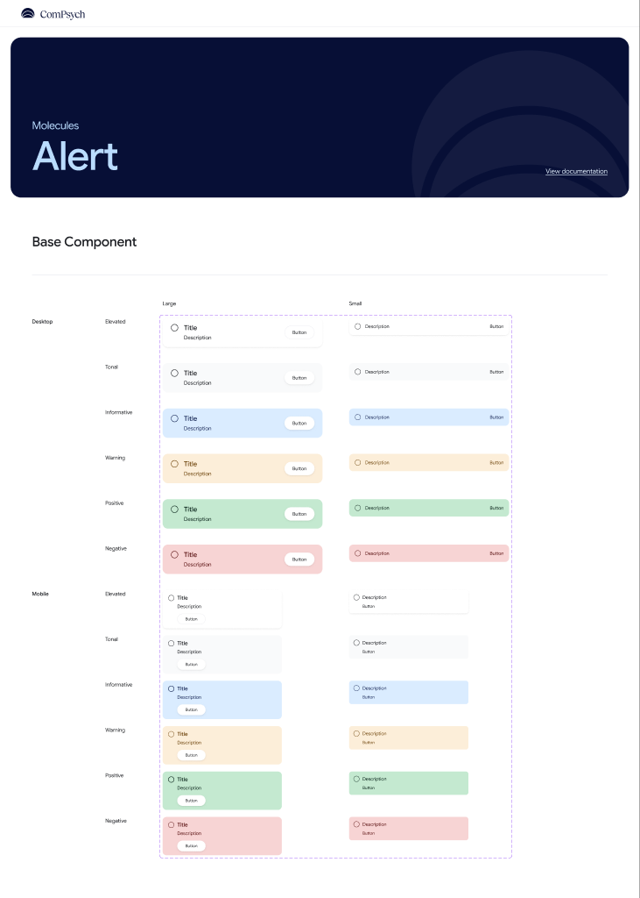

**Import**
```tsx
import { Alert } from '@/components/ds/Alert';
```
**Component File:** `components/ds/Alert.tsx`

#### Variants

There are six alert variants covering the full range of feedback contexts.

```tsx
<Alert variant="informative" description="Tips, help, or guidance." />
<Alert variant="warning"     description="Your session will expire in 5 minutes." />
<Alert variant="danger"      description="Failed to save changes." />
<Alert variant="positive"    description="Changes saved successfully." />
```

#### With Action

An optional action button prompts the user to take a next step.

```tsx
<Alert
  variant="informative"
  title="New feature available"
  description="Update the app to access the latest tools."
  actionLabel="Update now"
  onAction={handleUpdate}
/>
```

#### Dismissible

Add a dismiss button by setting `dismissible` to `true`.

```tsx
<Alert variant="danger" description="Failed to save." dismissible onDismiss={() => setVisible(false)} />
```

**Props**

| Name | Type | Default | Description |
|------|------|---------|-------------|
| `variant` | `'default' \| 'elevated' \| 'informative' \| 'warning' \| 'positive' \| 'danger'` | `'default'` | Color scheme and icon |
| `size` | `'sm' \| 'lg'` | `'lg'` | `lg` shows a bold title; `sm` is compact |
| `description` | `string` | — | **Required.** Body text |
| `title` | `string` | — | Bold heading (`lg` size only) |
| `hideIcon` | `boolean` | `false` | Removes the leading icon |
| `actionLabel` | `string` | — | Label for the optional action button |
| `onAction` | `() => void` | — | Action button handler |
| `dismissible` | `boolean` | `false` | Shows a × dismiss button |
| `onDismiss` | `() => void` | — | Dismiss button handler |

---

### Avatar

`Version: 1.0.0`

Circular user representation — text initials, photo, or icon. Supports a presence badge and activity ring.

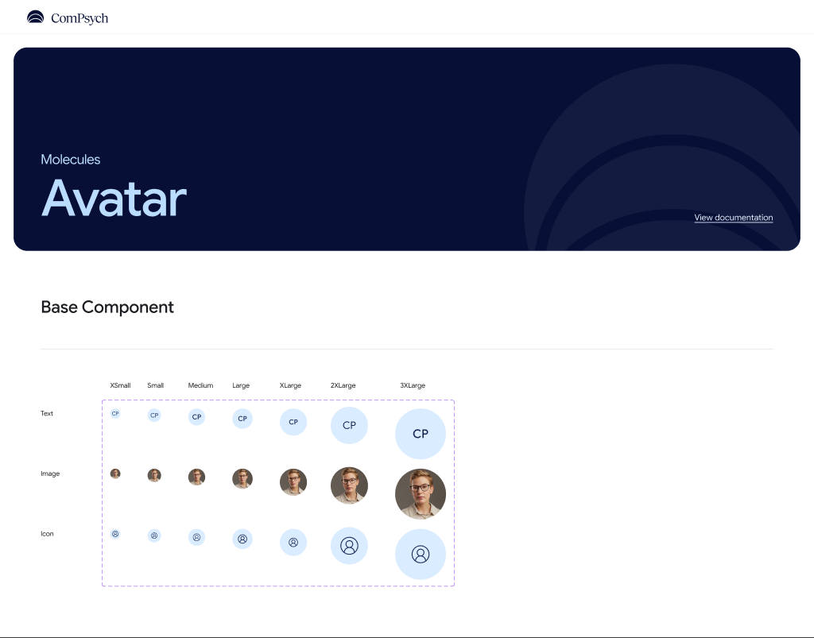

**Import**
```tsx
import { Avatar } from '@/components/ds/Avatar';
```
**Component File:** `components/ds/Avatar.tsx`

#### Sizes

Avatar can be rendered in seven sizes from extra-small to triple-extra-large.

```tsx
<Avatar variant="text" initials="CP" size="xs" />
<Avatar variant="text" initials="CP" size="md" />
<Avatar variant="text" initials="CP" size="xl" />
```

#### Image Avatar

Display a user's photo by providing an image source.

```tsx
<Avatar variant="image" source={{ uri: 'https://example.com/photo.jpg' }} size="lg" activityRing />
```

#### Letter Avatar

Render up to two initials when no photo is available.

```tsx
<Avatar variant="text" initials="JD" size="md" />
<Avatar variant="text" initials="AB" size="lg" />
```

**Props**

| Name | Type | Default | Description |
|------|------|---------|-------------|
| `variant` | `'text' \| 'image' \| 'icon'` | `'text'` | Content type |
| `size` | `'xs' \| 'sm' \| 'md' \| 'lg' \| 'xl' \| '2xl' \| '3xl'` | `'md'` | Circle diameter |
| `initials` | `string` | — | Up to 2 characters (text variant) |
| `source` | `ImageSourcePropType` | — | Photo source (image variant) |
| `activityRing` | `boolean` | `false` | Renders a coloured ring around the circle |
| `presenceBadge` | `boolean` | `false` | Renders a shield-check badge at bottom-right |

---

### Badge

`Version: 1.0.0`

Small status indicator as a pill, dot, or count. Used on icons and list items to show notification states.

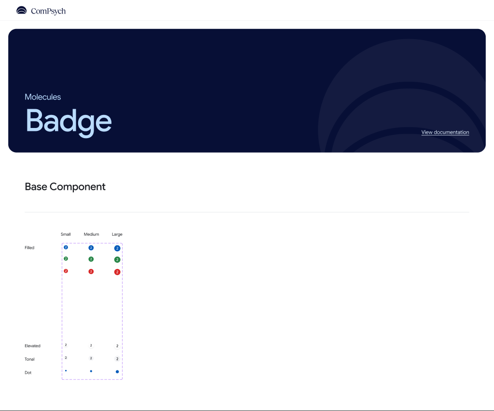

**Import**
```tsx
import { Badge } from '@/components/ds/Badge';
```
**Component File:** `components/ds/Badge.tsx`

#### Styles

Badge supports six visual styles covering neutral, semantic, and dot presentations.

```tsx
<Badge label={5}   badgeStyle="filled"   />
<Badge label="New" badgeStyle="positive" />
<Badge label="99+" badgeStyle="danger"   />
<Badge label={3}   badgeStyle="tonal"    />
<Badge             badgeStyle="dot"      />
```

#### Sizes

Badge can be rendered in three sizes.

```tsx
<Badge label={5} size="sm" />
<Badge label={5} size="md" />
<Badge label={5} size="lg" />
```

**Props**

| Name | Type | Default | Description |
|------|------|---------|-------------|
| `label` | `number \| string` | — | Text or count inside the badge |
| `size` | `'sm' \| 'md' \| 'lg'` | `'md'` | Controls diameter and font size |
| `badgeStyle` | `'filled' \| 'positive' \| 'danger' \| 'elevated' \| 'tonal' \| 'dot'` | `'filled'` | Color scheme and shape |

---

### Breadcrumb

`Version: 1.0.0`

Horizontal scrollable navigation trail with `/` dividers. The last item always renders as the current page.

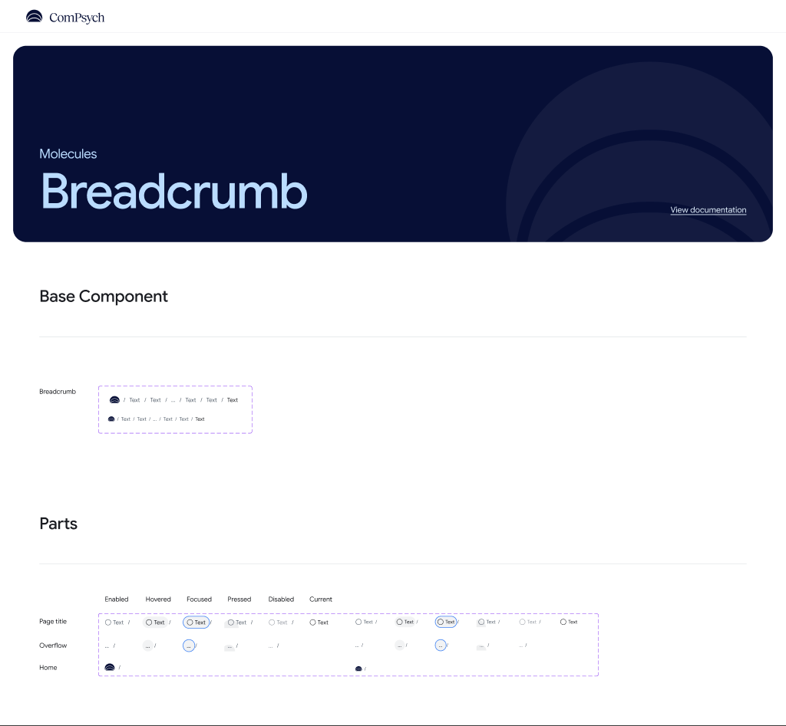

**Import**
```tsx
import { Breadcrumb } from '@/components/ds/Breadcrumb';
```
**Component File:** `components/ds/Breadcrumb.tsx`

#### Basic

Provide an ordered array of items. The last item is always treated as the current page.

```tsx
<Breadcrumb
  items={[
    { isHome: true, onPress: goHome },
    { label: 'Settings', onPress: goSettings },
    { label: 'Profile' },
  ]}
/>
```

#### With Overflow

Use `isOverflow: true` to collapse middle crumbs into an ellipsis.

```tsx
<Breadcrumb
  items={[
    { isHome: true, onPress: goHome },
    { isOverflow: true, onPress: expandCrumbs },
    { label: 'Current Page' },
  ]}
/>
```

**Props**

| Name | Type | Default | Description |
|------|------|---------|-------------|
| `items` | `BreadcrumbItem[]` | — | **Required.** Ordered crumb items |
| `size` | `'sm' \| 'lg'` | `'lg'` | Font size and vertical padding |

**BreadcrumbItem**

| Field | Type | Description |
|-------|------|-------------|
| `label` | `string` | Display text |
| `isHome` | `boolean` | Renders the home icon instead of text |
| `isOverflow` | `boolean` | Renders `…` for collapsed middle crumbs |
| `disabled` | `boolean` | Reduces opacity; non-interactive |
| `onPress` | `() => void` | Omit for the current/last crumb |

---

### Button

`Version: 1.0.0`

Buttons are touchable elements used to trigger actions. They support seven visual variants, four sizes, leading and trailing icons, a loading state, and full-width layout.

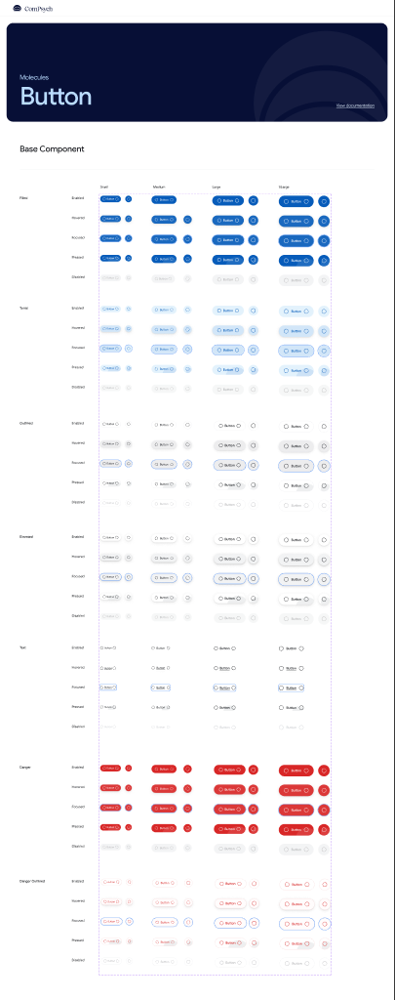

**Import**
```tsx
import { Button } from '@/components/ds/Button';
```
**Component File:** `components/ds/Button.tsx`

#### Variants

There are solid, outline, text, tonal, elevated, danger, and danger-outlined button types.

```tsx
<Button label="Filled"   variant="filled"   onPress={handlePress} />
<Button label="Tonal"    variant="tonal"    onPress={handlePress} />
<Button label="Outlined" variant="outlined" onPress={handlePress} />
<Button label="Text"     variant="text"     onPress={handlePress} />
<Button label="Danger"   variant="danger"   onPress={handlePress} />
```

#### Size

Button can be small, medium, large, or extra-large.

```tsx
<Button label="Small"  size="sm" onPress={handlePress} />
<Button label="Medium" size="md" onPress={handlePress} />
<Button label="Large"  size="lg" onPress={handlePress} />
```

#### Disabled

Disabled buttons reduce opacity and ignore press interactions.

```tsx
<Button label="Filled"   variant="filled"   disabled />
<Button label="Outlined" variant="outlined" disabled />
<Button label="Text"     variant="text"     disabled />
```

#### Icon Button

Can contain a leading or trailing icon, or be rendered as a square icon-only button.

```tsx
<Button label="Delete" variant="danger" leadingIcon={<Ionicons name="trash-outline" size={16} />} onPress={handleDelete} />
```

#### Loading Spinner

Use the `loading` prop to replace the label with an activity indicator.

```tsx
<Button label="Saving…" loading />
<Button label="Saving…" loading variant="outlined" />
```

**Props**

| Name | Type | Default | Description |
|------|------|---------|-------------|
| `label` | `string` | — | **Required.** Button text |
| `variant` | `'filled' \| 'tonal' \| 'outlined' \| 'elevated' \| 'text' \| 'danger' \| 'danger-outlined'` | `'filled'` | Visual style |
| `size` | `'sm' \| 'md' \| 'lg' \| 'xl'` | `'md'` | Height and padding |
| `disabled` | `boolean` | `false` | Disables interaction and reduces opacity |
| `loading` | `boolean` | `false` | Shows `ActivityIndicator` in place of label |
| `fullWidth` | `boolean` | `false` | Stretches to fill the parent |
| `iconOnly` | `boolean` | `false` | Square layout for single icons |
| `leadingIcon` | `React.ReactNode` | — | Icon before the label |
| `trailingIcon` | `React.ReactNode` | — | Icon after the label |
| `onPress` | `() => void` | — | Press handler |

---

### Card

`Version: 1.0.0`

Surface container for grouping related content. Supports three visual variants, four padding sizes, interactive press states, and a current/selected highlight.

**Import**
```tsx
import { Card } from '@/components/ds/Card';
```
**Component File:** `components/ds/Card.tsx`

#### Variants

There are outlined, filled, and gradient card types.

```tsx
<Card variant="outlined"><Text>Outlined card</Text></Card>
<Card variant="filled"><Text>Filled card</Text></Card>
<Card variant="gradient"><Text>Gradient card</Text></Card>
```

#### Interactive

Set `interactive` to enable press feedback and wrap the card in a `Pressable`.

```tsx
<Card interactive onPress={handleCardPress}><Text>Tap me</Text></Card>
```

#### Current State

The `current` prop applies a primary-colored border to indicate the selected card.

```tsx
<Card interactive current onPress={handlePress}><Text>Selected card</Text></Card>
```

**Props**

| Name | Type | Default | Description |
|------|------|---------|-------------|
| `variant` | `'outlined' \| 'filled' \| 'gradient'` | `'outlined'` | Visual treatment |
| `size` | `'sm' \| 'md' \| 'lg' \| 'xl'` | `'md'` | Inner padding |
| `interactive` | `boolean` | `false` | Enables press feedback |
| `disabled` | `boolean` | `false` | Reduces opacity |
| `current` | `boolean` | `false` | Primary border (selected state) |
| `fullWidth` | `boolean` | `false` | Fills parent width |
| `onPress` | `() => void` | — | Press handler (requires `interactive`) |
| `children` | `React.ReactNode` | — | Card content |

---

### Checkbox

`Version: 1.0.0`

Binary or indeterminate selection control. Supports controlled and uncontrolled usage.

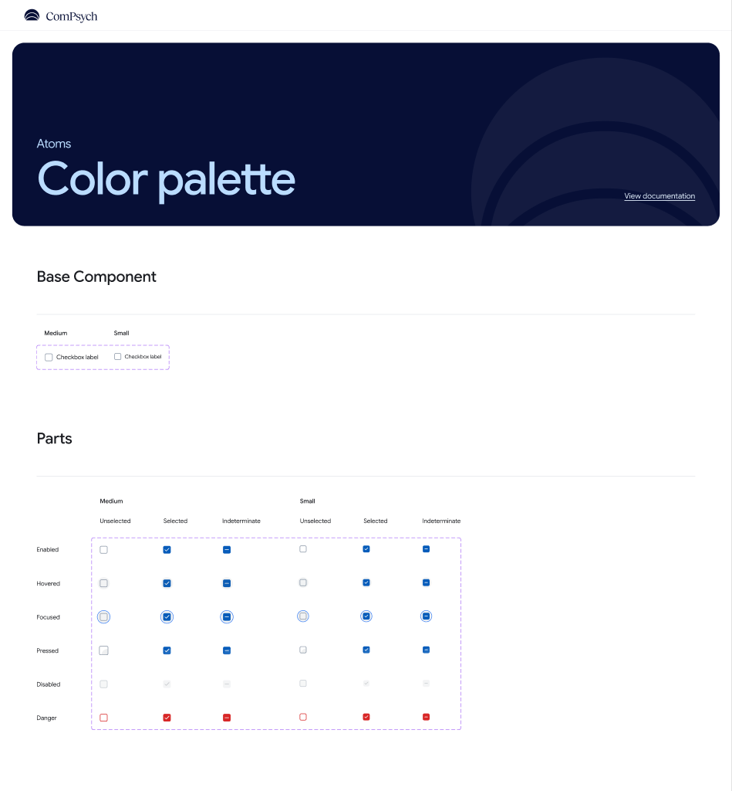

**Import**
```tsx
import { Checkbox } from '@/components/ds/Checkbox';
```
**Component File:** `components/ds/Checkbox.tsx`

#### States

Checkbox can be unchecked, checked, indeterminate, or disabled.

```tsx
<Checkbox defaultChecked={false} onValueChange={console.log} />
<Checkbox defaultChecked={true}  onValueChange={console.log} />
<Checkbox checked="indeterminate" onValueChange={handleChange} />
<Checkbox disabled />
```

#### Controlled

Use the `checked` prop with `onValueChange` for controlled usage.

```tsx
const [checked, setChecked] = useState(false);
<Checkbox checked={checked} onValueChange={setChecked} />
```

#### Sizes

Checkbox supports medium (default) and small sizes.

```tsx
<Checkbox size="md" defaultChecked />
<Checkbox size="sm" defaultChecked />
```

**Props**

| Name | Type | Default | Description |
|------|------|---------|-------------|
| `checked` | `boolean \| 'indeterminate'` | — | Controlled state |
| `defaultChecked` | `boolean` | `false` | Initial uncontrolled state |
| `onValueChange` | `(value: boolean \| 'indeterminate') => void` | — | Change handler |
| `size` | `'sm' \| 'md'` | `'md'` | Hit area and box size |
| `disabled` | `boolean` | `false` | Disables interaction |
| `accessibilityLabel` | `string` | — | Screen-reader label |

---

### Chip

`Version: 1.0.0`

Compact label pill for status, category, or filter display. Supports a leading icon, dismiss button, and badge count.

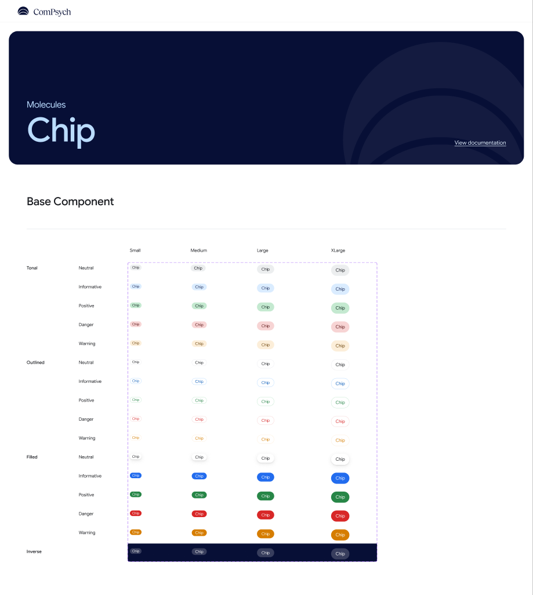

**Import**
```tsx
import { Chip } from '@/components/ds/Chip';
```
**Component File:** `components/ds/Chip.tsx`

#### Colors

Chip supports neutral, informative, positive, danger, and warning semantic colors.

```tsx
<Chip label="Neutral"   usage="neutral"     />
<Chip label="Info"      usage="informative" />
<Chip label="Completed" usage="positive"    />
<Chip label="Overdue"   usage="danger"      />
<Chip label="Pending"   usage="warning"     />
```

#### Sizes

Chip can be rendered in four sizes.

```tsx
<Chip label="Small"  size="sm" />
<Chip label="Medium" size="md" />
<Chip label="Large"  size="lg" />
```

#### Dismissible

Add a dismiss button at the trailing end using the `dismissible` prop.

```tsx
<Chip label="Filter" dismissible onDismiss={handleDismiss} />
```

**Props**

| Name | Type | Default | Description |
|------|------|---------|-------------|
| `label` | `string` | — | **Required.** Chip text |
| `size` | `'sm' \| 'md' \| 'lg' \| 'xl'` | `'md'` | Height and font |
| `usage` | `'neutral' \| 'informative' \| 'positive' \| 'danger' \| 'warning'` | `'neutral'` | Semantic color |
| `leadingIcon` | `React.ReactNode` | — | Icon before the label |
| `dismissible` | `boolean` | `false` | Shows a × button |
| `onDismiss` | `() => void` | — | Called when dismissed |
| `badge` | `number \| string` | — | Trailing count or label |

---

### Divider

`Version: 1.0.0`

Decorative separator — horizontal or vertical, thin or thick, solid or dashed.

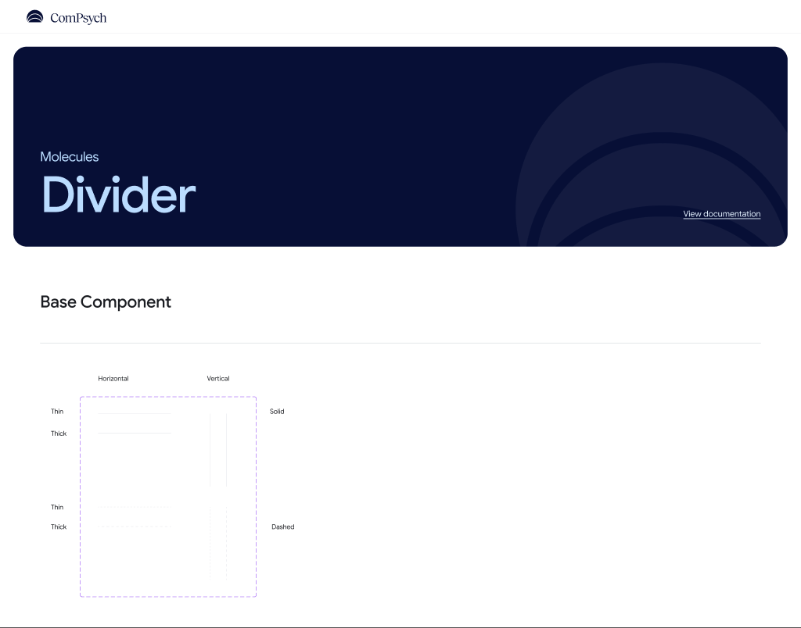

**Import**
```tsx
import { Divider } from '@/components/ds/Divider';
```
**Component File:** `components/ds/Divider.tsx`

#### Horizontal

A horizontal divider stretches to fill its parent width and is the default orientation.

```tsx
<Divider />
<Divider weight="thick" />
```

#### Vertical

A vertical divider fills its parent height and is used as a separator inside a row layout.

```tsx
<View style={{ flexDirection: 'row', height: 40 }}>
  <Text>Left</Text>
  <Divider variant="vertical" />
  <Text>Right</Text>
</View>
```

#### Dashed

The dashed style is used for section breaks or to indicate optional content areas.

```tsx
<Divider dashed />
<Divider weight="thick" dashed />
```

**Props**

| Name | Type | Default | Description |
|------|------|---------|-------------|
| `variant` | `'horizontal' \| 'vertical'` | `'horizontal'` | Orientation |
| `weight` | `'thin' \| 'thick'` | `'thin'` | 1px or 2px line |
| `dashed` | `boolean` | `false` | Dashed line pattern |

---

### EmptyState

`Version: 1.0.0`

Full-panel placeholder for empty screens. Supports an icon circle or illustrated card-collage graphic with an optional action button.

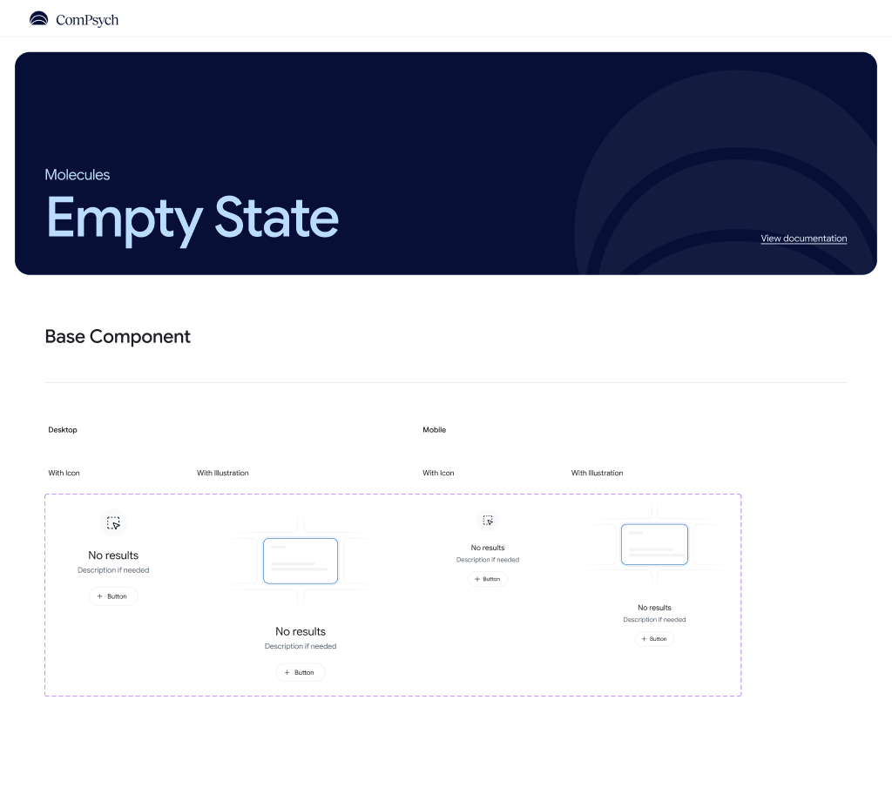

**Import**
```tsx
import { EmptyState } from '@/components/ds/EmptyState';
```
**Component File:** `components/ds/EmptyState.tsx`

#### Icon Style

The default style renders an icon inside a circular container above the title and description.

```tsx
<EmptyState
  title="No messages"
  description="When you receive messages they will appear here."
/>
```

#### Illustration Style

The `illustration` style renders a pure-View card collage — no image assets required.

```tsx
<EmptyState style="illustration" title="Nothing here yet" description="Get started by creating your first item." />
```

#### With Action

An optional action button prompts the user to take a next step.

```tsx
<EmptyState title="No results" description="Try adjusting your filters." actionLabel="Clear filters" onAction={clearFilters} />
```

**Props**

| Name | Type | Default | Description |
|------|------|---------|-------------|
| `style` | `'icon' \| 'illustration'` | `'icon'` | Graphic treatment |
| `viewport` | `'desktop' \| 'mobile'` | `'mobile'` | Token set for type scale and sizing |
| `title` | `string` | `'No results'` | Heading text |
| `description` | `string` | `'Description if needed'` | Body copy |
| `showDescription` | `boolean` | `true` | Hides description when `false` |
| `icon` | `React.ReactNode` | — | Custom icon in the circle |
| `actionLabel` | `string` | — | Action button label |
| `onAction` | `() => void` | — | Action press handler |

---

### Input

`Version: 1.0.0`

Single-line text field with floating label, helper/error text, and leading/trailing icon slots.

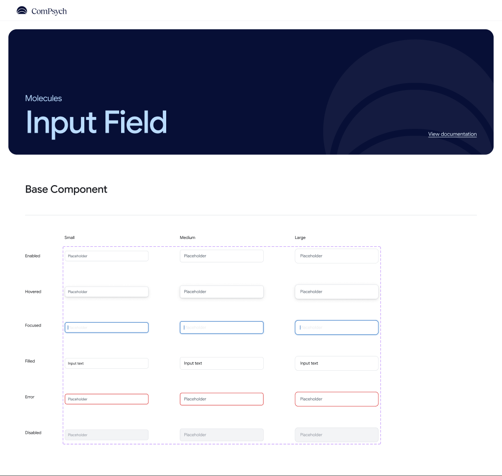

**Import**
```tsx
import { Input } from '@/components/ds/Input';
```
**Component File:** `components/ds/Input.tsx`

#### Basic

A simple text field with a floating label and placeholder.

```tsx
<Input label="Email" placeholder="you@example.com" />
```

#### Sizes

Input supports three sizes that control height, padding, and font scale.

```tsx
<Input size="sm" label="Small"  placeholder="Small field"  />
<Input size="md" label="Medium" placeholder="Medium field" />
<Input size="lg" label="Large"  placeholder="Large field"  />
```

#### Error State

Use `invalid` and `errorText` to communicate a validation error.

```tsx
<Input label="Username" invalid={!!errors.username} errorText={errors.username} />
```

#### With Icons

Leading and trailing icons can be placed inside the field.

```tsx
<Input label="Search" leadingIcon={<Ionicons name="search" size={20} />} />
```

**Props**

| Name | Type | Default | Description |
|------|------|---------|-------------|
| `size` | `'sm' \| 'md' \| 'lg'` | `'md'` | Height, padding, and font |
| `label` | `string` | — | Floating label |
| `helperText` | `string` | — | Hint text below the field |
| `errorText` | `string` | — | Error message; replaces `helperText` |
| `invalid` | `boolean` | `false` | Red border and error color |
| `leadingIcon` | `React.ReactNode` | — | Icon at the leading edge |
| `trailingIcon` | `React.ReactNode` | — | Icon at the trailing edge |

---

### Pagination

`Version: 1.0.0`

Page navigation with smart truncation. Supports numbered layout or compact prev/next-only mode.

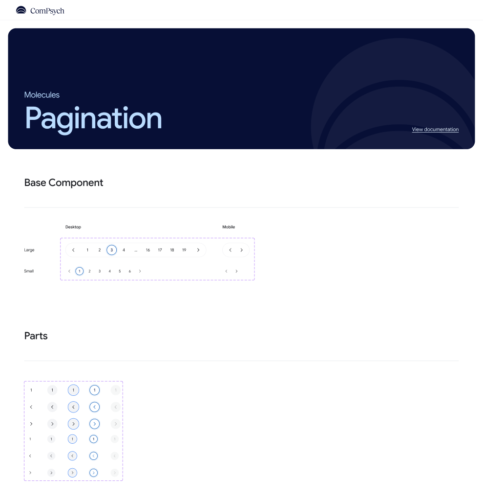

**Import**
```tsx
import { Pagination } from '@/components/ds/Pagination';
```
**Component File:** `components/ds/Pagination.tsx`

#### Standard

The default layout renders numbered page buttons with prev and next arrows inside a pill container.

```tsx
const [page, setPage] = useState(1);
<Pagination totalPages={12} currentPage={page} onPageChange={setPage} />
```

#### Compact

Compact mode renders only prev/next arrows — ideal for narrow mobile screens.

```tsx
<Pagination compact totalPages={20} currentPage={page} onPageChange={setPage} />
```

**Props**

| Name | Type | Default | Description |
|------|------|---------|-------------|
| `totalPages` | `number` | — | **Required.** Total pages |
| `currentPage` | `number` | — | **Required.** Active page (1-based) |
| `onPageChange` | `(page: number) => void` | — | **Required.** Page change handler |
| `size` | `'sm' \| 'lg'` | `'lg'` | `lg` inside a pill; `sm` bare |
| `siblingCount` | `number` | `1` | Pages shown on each side before `…` |
| `compact` | `boolean` | `false` | Prev/next only — no page numbers |

---

### ProgressTracker

`Version: 1.0.0`

Multi-step progress indicator with labelled steps and per-step progress bars.

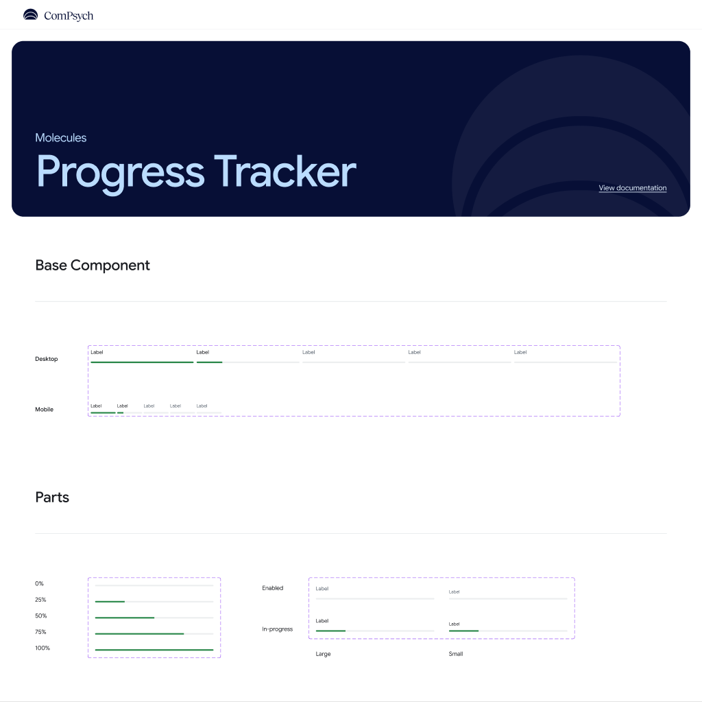

**Import**
```tsx
import { ProgressTracker } from '@/components/ds/ProgressTracker';
```
**Component File:** `components/ds/ProgressTracker.tsx`

#### Basic

Provide an array of steps with a `label` and `state` for each.

```tsx
<ProgressTracker
  steps={[
    { label: 'Personal info', state: 'completed' },
    { label: 'Address',       state: 'completed' },
    { label: 'Review',        state: 'active'    },
    { label: 'Submit',        state: 'pending'   },
  ]}
/>
```

#### Without Labels

Set `showLabels` to `false` for a compact bar-only indicator.

```tsx
<ProgressTracker showLabels={false} steps={steps} />
```

**Props**

| Name | Type | Default | Description |
|------|------|---------|-------------|
| `steps` | `TrackerStep[]` | — | **Required.** Step descriptors |
| `size` | `'sm' \| 'lg'` | `'lg'` | Label font size |
| `showLabels` | `boolean` | `true` | Show step labels below bars |

**TrackerStep**

| Field | Type | Description |
|-------|------|-------------|
| `label` | `string` | Step display name |
| `state` | `'completed' \| 'active' \| 'pending'` | 100% / 25% / 0% fill |

---

### RadioButton

`Version: 1.0.0`

Single-selection control. Use within a group where only one option can be selected at a time.

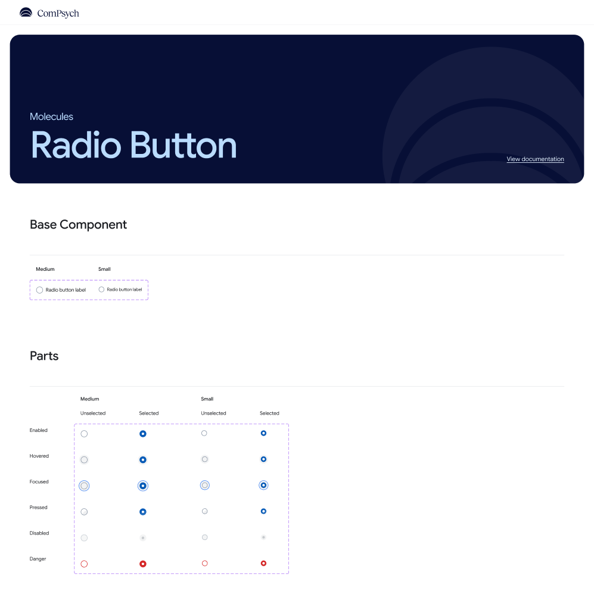

**Import**
```tsx
import { RadioButton } from '@/components/ds/RadioButton';
```
**Component File:** `components/ds/RadioButton.tsx`

#### States

RadioButton can be unselected, selected, or disabled.

```tsx
<RadioButton defaultSelected={false} />
<RadioButton defaultSelected={true}  />
<RadioButton disabled />
```

#### In a Group

Manage selection state externally and pass `selected` and `onValueChange` to each option.

```tsx
const [selected, setSelected] = useState<string>('a');

<RadioButton selected={selected === 'a'} onValueChange={() => setSelected('a')} accessibilityLabel="Option A" />
<RadioButton selected={selected === 'b'} onValueChange={() => setSelected('b')} accessibilityLabel="Option B" />
<RadioButton selected={selected === 'c'} onValueChange={() => setSelected('c')} disabled />
```

**Props**

| Name | Type | Default | Description |
|------|------|---------|-------------|
| `selected` | `boolean` | — | Controlled state |
| `defaultSelected` | `boolean` | `false` | Initial uncontrolled state |
| `onValueChange` | `(value: boolean) => void` | — | Change handler |
| `size` | `'sm' \| 'md'` | `'md'` | Hit area and ring size |
| `disabled` | `boolean` | `false` | Disables interaction |
| `accessibilityLabel` | `string` | — | Screen-reader label |

---

### Slider

`Version: 1.0.0`

Continuous value selector with a draggable thumb. Tap anywhere on the track to jump; drag to adjust. Resists gesture theft from parent `ScrollView`.

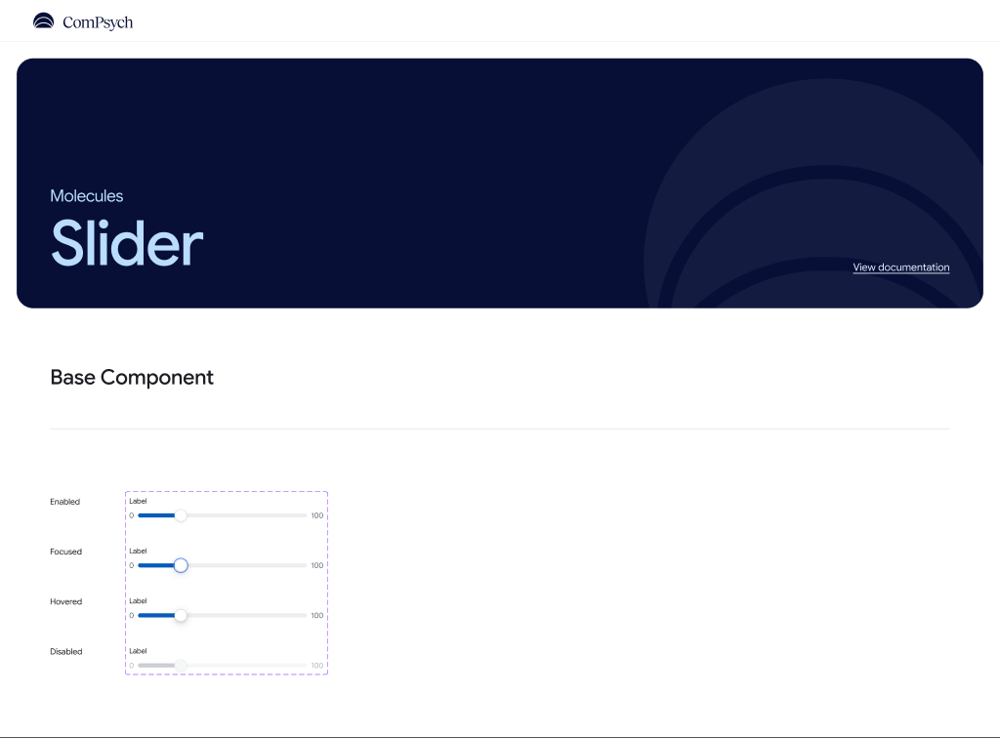

**Import**
```tsx
import { Slider } from '@/components/ds/Slider';
```
**Component File:** `components/ds/Slider.tsx`

#### Basic

A simple uncontrolled slider with default `min` (0) and `max` (100).

```tsx
<Slider onSlidingComplete={(v) => console.log(v)} />
```

#### With Label

Use the `label` prop to render a descriptor above the track.

```tsx
const [volume, setVolume] = useState(50);
<Slider label="Volume" value={volume} onValueChange={setVolume} />
```

#### Step

Use the `step` prop to snap the thumb to fixed intervals.

```tsx
<Slider defaultValue={0} min={0} max={100} step={10} showMinMax />
```

#### Disabled

A disabled slider reduces opacity and ignores interaction.

```tsx
<Slider value={40} disabled label="Locked setting" />
```

**Props**

| Name | Type | Default | Description |
|------|------|---------|-------------|
| `value` | `number` | — | Controlled value |
| `defaultValue` | `number` | `min` | Initial uncontrolled value |
| `min` | `number` | `0` | Minimum |
| `max` | `number` | `100` | Maximum |
| `step` | `number` | `1` | Snap interval |
| `onValueChange` | `(value: number) => void` | — | Called while dragging |
| `onSlidingComplete` | `(value: number) => void` | — | Called on release |
| `label` | `string` | — | Label above the track |
| `showMinMax` | `boolean` | `true` | Min/max labels on each side |
| `disabled` | `boolean` | `false` | Disables interaction |

---

### Switch

`Version: 1.0.0`

Animated binary toggle with 150ms thumb slide and background color transition. Supports controlled and uncontrolled usage.

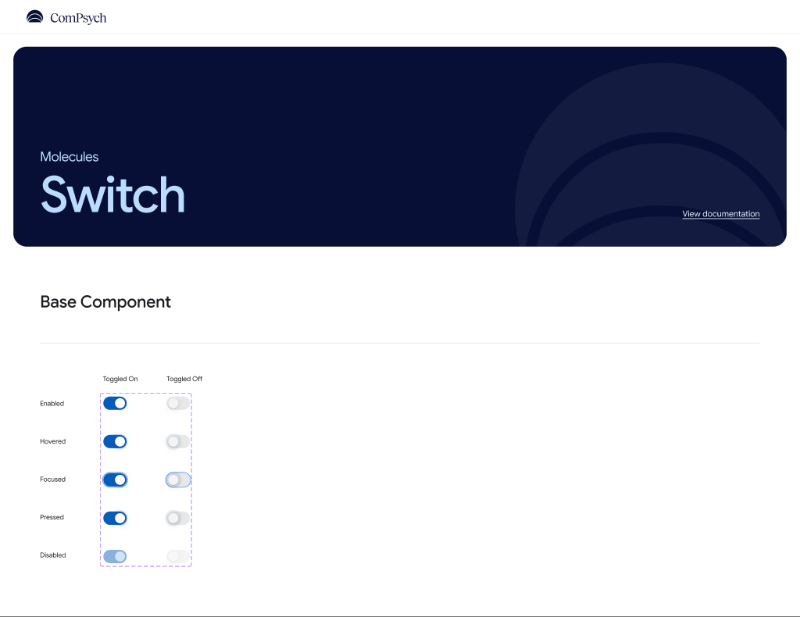

**Import**
```tsx
import { Switch } from '@/components/ds/Switch';
```
**Component File:** `components/ds/Switch.tsx`

#### On and Off

Switch can be toggled between on and off states.

```tsx
<Switch defaultValue={false} onValueChange={console.log} />
<Switch defaultValue={true}  onValueChange={console.log} />
```

#### Controlled

Use the `value` prop with `onValueChange` for controlled usage.

```tsx
const [enabled, setEnabled] = useState(false);
<Switch value={enabled} onValueChange={setEnabled} accessibilityLabel="Notifications" />
```

#### Disabled

Disabled switches reduce opacity and ignore press interactions.

```tsx
<Switch value={false} disabled />
<Switch value={true}  disabled />
```

**Props**

| Name | Type | Default | Description |
|------|------|---------|-------------|
| `value` | `boolean` | — | Controlled value |
| `defaultValue` | `boolean` | `false` | Initial uncontrolled value |
| `onValueChange` | `(value: boolean) => void` | — | Toggle handler |
| `disabled` | `boolean` | `false` | Disables interaction |
| `accessibilityLabel` | `string` | — | Screen-reader label |

---

### Tooltip

`Version: 1.0.0`

Short contextual label with a directional arrow. Use to clarify icon buttons, abbreviations, or truncated text.

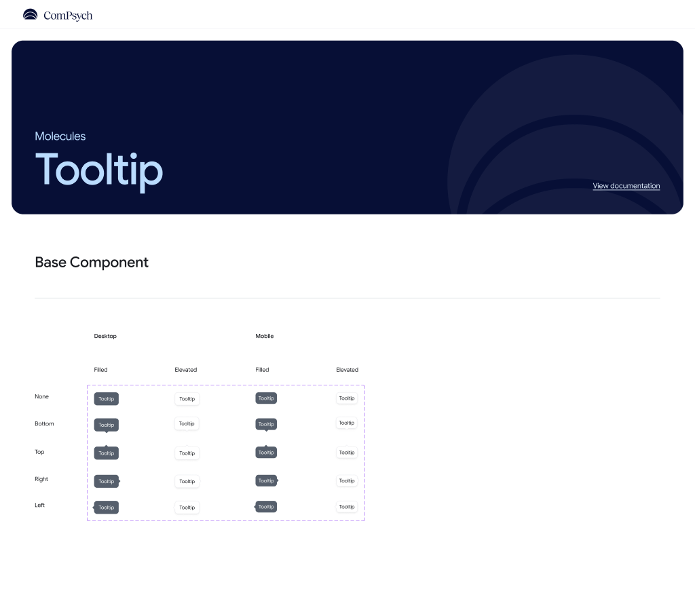

**Import**
```tsx
import { Tooltip } from '@/components/ds/Tooltip';
```
**Component File:** `components/ds/Tooltip.tsx`

#### Filled

The filled variant uses a dark inverse surface — the default and most common style.

```tsx
<Tooltip text="More options" />
<Tooltip text="Delete item" direction="bottom" />
```

#### Elevated

The elevated variant uses a white surface with a border and shadow — for use on dark backgrounds.

```tsx
<Tooltip text="Save your work" variant="elevated" direction="bottom" />
```

#### Directions

The `direction` prop describes where the target is relative to the bubble, which determines where the arrow is drawn.

```tsx
<Tooltip text="No arrow"    direction="none"   />
<Tooltip text="Arrow up"    direction="top"    />
<Tooltip text="Arrow down"  direction="bottom" />
<Tooltip text="Arrow left"  direction="left"   />
<Tooltip text="Arrow right" direction="right"  />
```

**Props**

| Name | Type | Default | Description |
|------|------|---------|-------------|
| `text` | `string` | — | **Required.** Tooltip content |
| `variant` | `'filled' \| 'elevated'` | `'filled'` | Dark inverse or white elevated |
| `direction` | `'none' \| 'top' \| 'bottom' \| 'left' \| 'right'` | `'none'` | Where the target is relative to the bubble |

---

## Token System

All components reference only `sys.*` tokens via:

```ts
import { sys } from '@/components/ds/tokens';
const { colorRoles: cr, dimensions: dim, typeScale: ts } = sys;
```

Never apply `core.*`, `product.*`, or `brand.*` tokens directly in UI — they are internal plumbing and will not respond to theme or brand changes.

---

## Project Structure

```
components/ds/          All 17 DS component implementations
components/ds/tokens.ts sys.* token bridge from @javierkonpo/design-system
app/(tabs)/index.tsx    Component gallery / showcase screen
docs/
  components.md         Full component API reference (RNEUI-style)
  Components.docx       Word document with Figma screenshots
  components.pdf        PDF reference with Figma screenshots
  images/               Figma component screenshots
```
